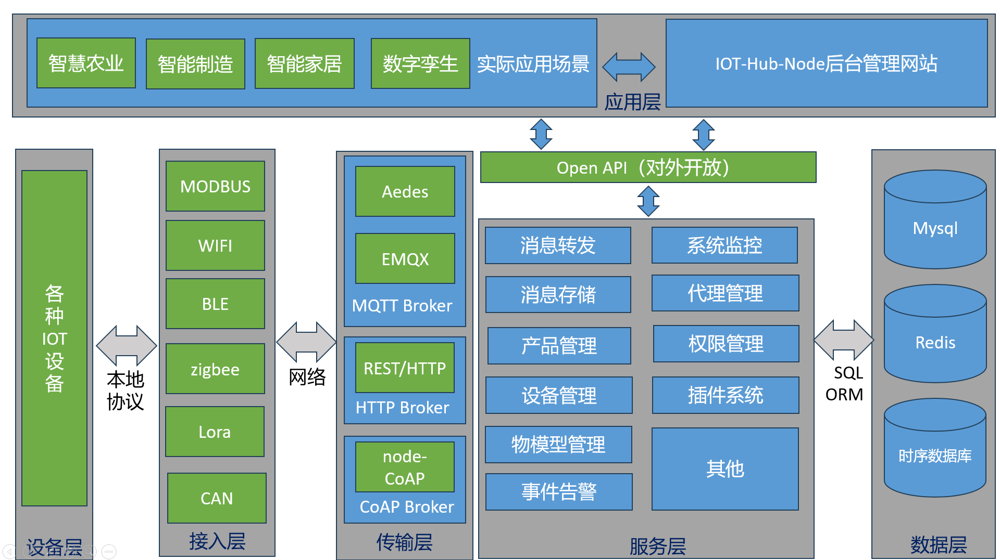

# IoT-Hub-Node  设计文档

## 概述

本文档旨在提供项目的整体设计概述和高级架构。

## 目标

| 功能           | 说明                                              | 进度 | 备注 |
| -------------- | ------------------------------------------------- | ---- | ---- |
| 组织，项目管理 |                                                   |      |      |
| 设备管理       |                                                   |      |      |
| 设备监控       |                                                   |      |      |
| 协议接入-MQTT  | 提供基于Aedes的原生MQTT服务，也可接入更专业的EMQX |      |      |
| Modbus TCP RTU |                                                   |      |      |
| HTTP/HTTPS     |                                                   |      |      |
| 系统日志       |                                                   |      |      |
| 用户管理       |                                                   |      |      |
|                |                                                   |      |      |

## 架构

## 技术栈

### 客户端

- 技术选择：使用 React 框架和 TypeScript 语言
- 组件库：使用 Material-UI
- 数据管理：使用 Redux

### 服务器

- 技术选择：使用 Node.js 和 Express 框架
- 数据库：使用 MongoDB

### 数据流

以下是数据在项目中的流动方式：

1. 客户端发送请求到服务器
2. 服务器处理请求并与数据库进行交互
3. 数据库返回结果给服务器
4. 服务器将结果发送回客户端

### 用户交互

用户与系统的主要交互方式为：

- 注册和登录
- 创建和编辑内容
- 浏览和搜索内容

## 组件设计

本节介绍了项目中的主要组件和其功能。

### 组件 1

- 职责：描述组件 1 的职责和功能
- 输入：接收哪些输入数据
- 输出：产生哪些输出数据

### 组件 2

- 职责：描述组件 2 的职责和功能
- 输入：接收哪些输入数据
- 输出：产生哪些输出数据

...

## 数据库设计

本节描述了项目中使用的数据库模型和表结构。

### 用户表

- 字段 1：描述字段 1 的含义和类型
- 字段 2：描述字段 2 的含义和类型
- ...

### 内容表

- 字段 1：描述字段 1 的含义和类型
- 字段 2：描述字段 2 的含义和类型
- ...

## 未解决问题

本节列出了设计过程中遇到的一些未解决的问题，以及需要进一步讨论和研究的主题。

- 问题 1：描述问题 1 和讨论
- 问题 2：描述问题 2 和讨论
- ...

## 参考：

ThingsPanel：https://github.com/ThingsPanel/ThingsPanel-Go

